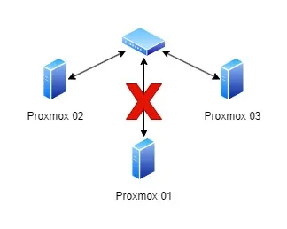
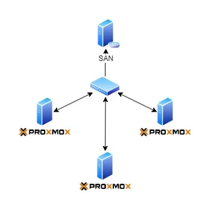
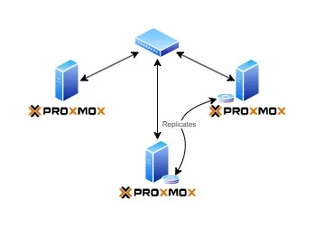

# เมื่อ Home Labs เกิดปัญหา (Proxmox)

เรื่องนี้เกิดจากเหตุการณ์ล่าสุด ที่ Home Labs ที่ใช้งานอยู่เกิดปัญหา จนทำให้ข้อมูลย้อนหลังกลับไปถึง 4 เดือน จึงอยากจะจดไว้เป็นบทเรียนสำคัญ ในการดูแลระบบ ไม่ว่าจะขนาดเล็กหรือใหญ่ใดๆก็ตาม ระบบจำเป็นต้องได้รับการดูแลและป้องกันเอาไว้เสมอ เพราะเมื่อมันเกิดปัญหาขึ้นมา แก้ไขปัญหามันเหนื่อยกว่าที่ต้องดูแลมากนัก

## Introduce

ก่อนจะเข้าเรื่อง ขอเกริ่นนำก่อน ปัจจุบันที่บ้านจะมีการทำ Home Labs ไว้สำหรับทดสอบหรือเรียนรู้อะไรใหม่ๆเพิ่มเติม รวมถึงทำเอาไว้ใช้งานทั่วไปในบ้านด้วย ซึ่งก็จะประกอบด้วย Notebook เครื่องเก่าที่สภาพไม่สามารถพกพาได้แล้ว และ PC เก่าๆอีก 2 เครื่อง เอามาทำ Virtualize เพื่อทดสอบงานต่างๆ รวมถึง Home Assistant (home-assistant.io) server ที่ใช้งานด้วยเช่นกัน

โดยทั้ง 3 เครื่องจะรัน Proxmox VE (Proxmox — Powerful open-source server solutions) ให้สามารถ virtualize server จำนวนมากๆ ใช้ในแต่ละงานได้ และใน 3 Nodes นี้จะทำ HA ไว้ เพื่อที่เวลาเครื่องใดเครื่องหนึ่งมีปัญหา อีกเครื่องจะสามารถรัน VM นั้นๆทดแทนได้ทันที (แทบไม่มี downtime)

สำหรับเรื่องของ Home Assistant หรือ Proxmox ขอเก็บไว้เล่าสู่กันฟังภายหลัง

## จุดเริ่มต้น (ที่ยังไม่ทราบว่าเป็นปัญหา)

จากสัปดาห์ที่ผ่านมา ประมาณกลางสัปดาห์ พี่ชายโทรแจ้งว่า Server ทดสอบไม่สามารถใช้งานได้ หลังตรวจสอบเบื้องต้น ก็เจอว่าเครื่อง Proxmox 01 มีอาการเอ๋อ VMs ทุกตัวที่รันอยู่ในนี้ไม่สามารถเข้าถึงได้ ซึ่งก็คิดว่า “ไม่ได้เป็นปัญหาอะไรหนิ เราทำ HA ไว้แล้ว เดี๋ยวมันก็ย้ายไปรันที่ Node อื่น งานนี้ชิลล์” หลังจากความคิดนั้น สิ่งที่ทำก็คือ “Force Restart Proxmox 01” ก็เป็นไปตามปกติ VMs migrate ไปรันบน Proxmox 03 ตามปกติ จนกว่าเครื่อง 01 จะ Online ตามเดิม

## กลิ่นแปลกๆ

จากที่สั่ง Restart ไป เครื่อง 01 กลับมา Online ตามปกติ แต่เริ่มมีสัญญาณแปลกๆ คือ VMs ไม่สามารถ Migrate กลับมารันบนเครื่อง 01 ได้ โดยที่เครื่อง 03 พยายามส่งคำสั่งขอ Migrate หลายรอบแล้ว จึงยังปล่อยมันไปก่อน ตอนนี้สิ่งสำคัญคือตรวจสอบสอบว่าทุกเครื่องกลับมาทำงานตามปกติก่อน

จากที่ตรวจแต่ละเครื่อง เจออาการแปลกๆคือ เอ๊ะ ทำไมเครื่อง Windows ที่ Join Domain อยู่มัน Untrust กับ AD หมดเลย จึงต้องไล่แก้ไขทีละเครื่องจนครบ หลังจากนั้นก็แจ้งว่าระบบกลับมาใช้งานได้ตามปกติแล้ว

ที่ผิดปกติอีกอย่างคือ Home Assistant ทุกคน Session Reset หมดเลย ต้อง Login ใหม่กันหมด ก็ไม่ได้แปลกใจอะไร

## ต้นตอของปัญหา

กลับมาที่ปัญหาที่เครื่องไม่สามารถ Migrate กลับมาได้ ไล่เช็คสาเหตุจนพบว่า Switch (No Brand) เสียไป Port นึง ทำให้เครื่อง 01 ไม่สามารถคุยกับเครื่อง 03 ได้ ส่งผลทำให้ไม่สามารถ Migrate VMs กลับมารันที่เครื่อง 01 ได้ตามปกติ

ฮั่นแน่ แก้ไขไม่ยาก port พังก็ย้าย port ผลกระทบคือ port ที่เสียคือ SFP+ 10Gbps แต่ย้ายมาเหลือแค่ 2.5Gbps แต่ไม่เป็นไร ทำให้ระบบกลับมาใช้ได้ก่อน อุปกรณ์ที่เสียหายค่อยว่ากัน เรารับความเสี่ยงตั้งแต่เลือกของ No Brand แล้ว

หลังจากสลับ Port Network กลับมาทำงานปกติ VMs สามารถ Migrate กลับมารันที่เครื่อง 01 ได้อย่างที่ควรจะเป็น ปิดจ๊อบ สบายใจได้ ปล่อยให้ระบบมันรันของมันต่อไป วันหยุดค่อยเช็ครายละเอียด

## ปัญหาที่แท้จริง

ผ่านไป 24 ชม.จากเหตุการณ์ข้างต้น เริ่มพบปัญหาที่แท้จริง โดยได้รับแจ้งว่าเข้าถึง Database ไม่ได้ และเมื่อทำการตรวจสอบ พบว่าข้อมูล User, Database ดังกล่าว หายไปอย่างไร้ร่องรอย!!!!

ตายละหว่า เกิดอะไรขึ้น, หลังจากหาดูสักพัก พบว่าไม่ใช่แค่ส่วนนี้นะ VMs ทุกตัวที่รันบน 01 โดนย้อนข้อมูลกลับไปประมาณช่วงปลายเดือน 5 หมดเลย!!! เริ่มบันเทิงละ

โดยสุดท้ายแล้ว ไล่จนพบว่าต้นตอปัญหาก็คือ Switch ที่พังไปนั่นแหละ จริงๆแล้วมันหยุดทำงานตั้งแต่ปลายเดือน 5 จนถึงปัจจุบัน…แล้วมันทำให้ข้อมูล Rollback กลับได้ยังไง “มา!!! ผมจะเล่าให้ฟัง”

Proxmox จะมี Feature HA เพื่อให้กรณีที่เครื่องเรามีปัญหา Node อื่นๆที่พร้อมทำงานจะรับหน้าที่เข้ามาทำงานแทนให้ โดยปกติเค้าก็จะใช้วิธีเก็บข้อมูล VMs บน SAN แล้วให้แต่ละ Node รันทดแทน วิธีการนี้จะไม่มีการสะดุดกรณีเครื่องมีปัญหา

ซึ่งนี่มันคือ Home Labs นะคร๊าบ ผมไม่มี SAN ในบ้านจ้า ทางแก้คือ ก็ Duplicate VMs ไว้ที่ทุกๆ Node นั่นแหละ โดยใช้ Proxmox ทำ Replicate เพื่อ Sync ข้อมูล VMs ตลอด (ทุก 15s — 15min แล้วแต่ความสำคัญ)

ฟังดูทุกอย่างสวยงามและปกติดี ปัญหามันอยู่ตรงที่ เมื่อ Network ใช้ไม่ได้ Replicate Data มันก็ทำไม่ได้เช่นกัน!!! อ๋อกันไหม…. ใช่ครับ 03 ใช้ข้อมูลตั้งแต่ปลายเดือน 5 ก่อนที่ Port ของ Switch จะพัง ในการรัน VMs ต่อเนื่อง!!! ซึ่งมันทำให้ เมื่อแก้ไขเรื่องที่ 2 เครื่องไม่สามารถคุยกันได้ ระบบกลับมาวิ่งปกติ จะทำการ replicate data จาก 03 -> 01 เพราะเป็นเครื่องที่รันล่าสุด

ถือว่าเป็นการย้อนกลับที่สมบูรณ์แบบมากเลยทีเดียว :scream:

## ข้อสรุป

เรียนรู้จากเหตุการณ์ที่เกิดขึ้น เราจะได้บทเรียนอะไรหลายๆอย่างจากเรื่องนี้ เพื่อแก้ไขและป้องกันปัญหาในอนาคตอีกมาก ขอสรุปเป็นข้อๆตามนี้

ระบบ Backup สำคัญมาก ไม่ว่าระบบเล็กหรือใหญ่ เรื่องไม่คาดฝันเกิดขึ้นได้เสมอ ถ้าเรามี Backup ที่เพียงพอ จะลดความเสียหายลงได้มากเลยทีเดียว
อย่าละเลย Monitoring System กรณีนี้จริงๆคือไม่รู้ว่าระบบมีปัญหามา 4 เดือน ทั้งที่ถ้าเรารู้ตัวเร็วและแก้ไขได้เร็วกว่านี้ ความเสียหายก็จะแทบไม่เกิดเลย
ควรมี Checklist ในการตรวจสอบปัญหา เคสนี้พอได้รับแจ้ง ก็รีบดู รีบเช็คคร่าวๆ เพียงแค่ให้ระบบมันกลับมารันเท่านั้น ถ้ามีขั้นตอนตรวจสอบที่ชัดเจน เราจะเจอปัญหาว่าระบบมันไม่ sync ข้อมูล ไม่ควรให้อีก Node นำข้อมูลเก่ามารัน เพื่อไม่ให้เกิดการย้อนเวลาแบบนี้
สุดท้ายแล้ว ผมยังโชคดี ที่ระบบนี้เป็นเพียงระบบทดสอบ แต่ทั้งนี้ก็ยังเกกิดความเสียงานการที่อยู่ระหว่างการพัฒนาสูญหายไปแล้วเอากลับคืนมาไม่ได้ และข้อมูลใน Home Assistant สูญหายไปพอสมควร แต่ก็เป็นเพียงของส่วนตัว จริงไม่ได้ส่งผลกระทบอะไร ยังไม่รวมถึงเวลาในการแก้ไขปัญหา ที่ต้องมาไล่หาสาเหตุและพยายามดึงกลับเพราะไม่มี Checklist ว่าเวลาเกิดเหตุเราควรทำอะไรบ้างด้วย

แต่จะดีที่สุด ถ้าเราสามารถป้องกันไม่ให้เกิดเหตุการณ์เช่นนี้ ไม่ว่าจะเป็นที่ Test Environment หรือ Production ก็ตาม ขอฝากไว้เป็นบทเรียนสำหรับผู้ดูแลระบบทุกท่านครับ

**Published:** 2024-09-22
