# ทริปแรกกับ Subaru Forester 2022 (SK) เน้นใช้งาน Eyesight เลย

อยากโน๊ตและจดจำความรู้สึกแรกๆ ในช่วงเห่อรถ ที่ได้นำมาใช้งานจริงๆ และเป็นทริปการเดินทางแรก ที่ใช้รถ C-SUV ในการเดินทางไกลของตัวเอง

บทความนี้จะเป็นการเล่ารูปแบบการใช้งาน ความรู้สึก และสัมผัสที่ใช้เป็นหลัก ไม่ได้เน้นเรื่องเกี่ยวกับสมรรถณะหรือเปรียบเทียบกับใครเลย จะมีเปรียบเทียบกันบ้าง จากประสบการณ์ตัวเอง ที่ใช้ในรถคันอื่น แต่คนละประเภทกันอยู่ดี ประสบการณ์ที่ใช้รถเดินทางไกล ก่อนหน้านี้จะเป็น Nissan Almera (2015) E-MT ครับ

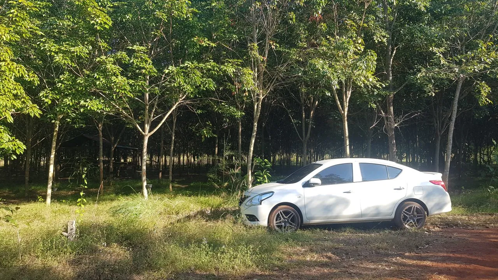

ยินดีต้อนรับ "ช้างศึก" สู่ครอบครัว (ตอนแรกตั้งชื่อ "ช้างเผือก" แต่เรียกผิดบ่อยเลยใช้ชื่อนี้แล้วกัน) C-SUV คันแรก จากเดิมที่ใช้งานแต่รถเก๋ง B-Segment มาโดยตลอด จุดประสงค์หลักของการเลือกรถคันนี้ โจทย์คือ นำใช้งานเดินทางไกลให้สะดวกสบายมากขึ้น รวมถึงเวลาพาทางบ้านไปก็ต้องการให้เดินทางได้สะดวกขึ้นและเหนื่อยน้อยลงครับ

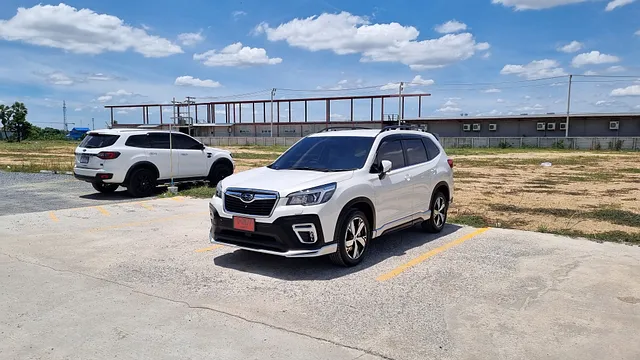
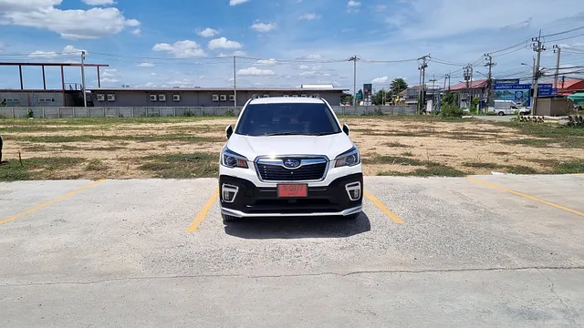
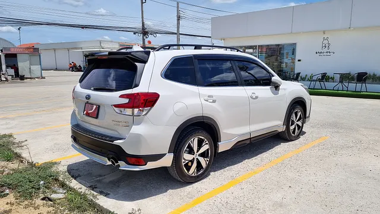

อันดับแรกที่รู้สึกถึงความแตกต่างเลย คือ ขนาดของรถ ที่ใหญ่ขึ้น, สูงขึ้น ต้องปรับตัวกันสักพักใหญ่ๆเลยทีเดียว การกะระยะ วงเลี้ยวต่างๆ แต่ส่วนตัวค่อนข้างชอบมากๆ เพราะทัศนวิสัยภายใน มองออกมาโปร่งโล่งตามากๆ จุดบอดน้อยมากจริงๆ โดยเฉพาะเสา A ตั้งแต่ขับมาผมชอบทัศนวิสัยรุ่นนี้ที่สุดแล้ว (เทียบกับ Accord ตาเพชร, Almera 2015, BMW Series 5 (E60) เคยลองเท่านี้ เพราะเป็นรถของที่บ้าน)

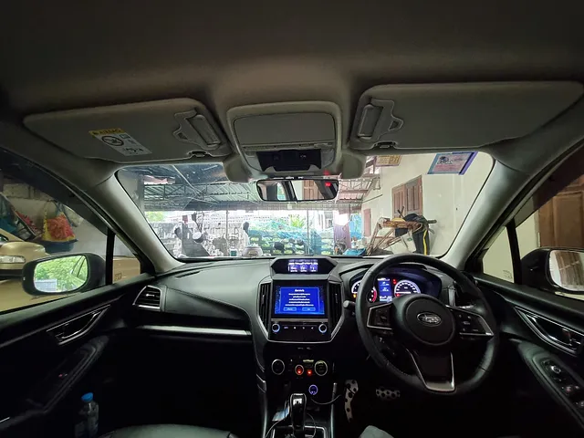
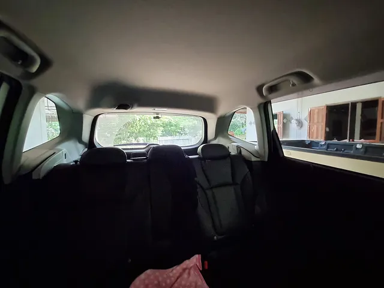

หลังจากได้จับรถคันนี้วิ่งทำธุระในเมืองอยู่ประมาณ 800 Km ก่อนออกเดินทาง ตจว. ปรับตัวกันจนคุ้น ทำความรู้จักกับระบบต่างๆของรถพอสมควร ที่สำคัญ ข้อมูลคู่มือรถอ่านครบ (แต่จำได้ไม่หมด) ถือเป็นการเตรียมพร้อมก่อนเดินทางแล้วกัน

ทริปแรกของการเดินทางนี้จะเป็น นนทบุรี - นครพนม (อ.นาทม) ระยะทางประมาณ 750 Km โดยจะเดินทางไปตามเส้นทางหลัก ถ.มิตรภาพ ก่อนจะเลี้ยวเข้าสู่ มหาสารคาม -> กาฬสินธ์ -> ขึ้นภูพาน -> สกลนคร -> อ.ศรีสงคราม และเข้า อ.นาทม ที่เป็นที่หมายปลายทางของเรา

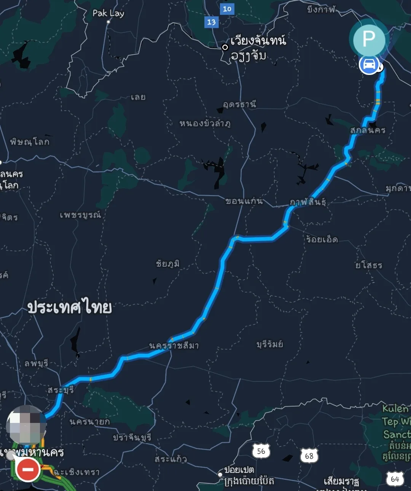

ช่วงออกจากกรุงเทพ รถค่อนข้างเยอะ ติดบ้างพอสมควร มีเปิดใช้งาน Eyesight เป็นระยะๆ ส่วนมากจะต้องปิดเนื่องจากเวลาเจอรถแทรกเข้าแทรกออก หรือมอไซค์ปาดแทรก จะทำให้รถเบรคตัวโก่ง หรือเร่งแบบน่ากลัวจะไปทิ่มรถคันหน้าอยู่พอสมควร

ตัวรถค่อนข้างนิ่มนวล ซับแรงถนนที่เรียบมากๆในบ้านเราได้เป็นอย่างดี ไม่ถึงกับนิ่มสบายแบบลอย แต่สบายในแบบที่ไม่ทำให้รู้สึกเหนื่อย ตอบโจทย์กับครอบครัวทั้งช่วงความเร็วต่ำ (น้อยกว่า 80) และความเร็วเดินทาง (80–110)

ตั้งแต่เริ่มออกจากแถววังน้อย ผมแทบจะเปิด Eyesight วิ่งตลอดเลย เราคอยควบคุมพวงมาลัยอย่างเดียว ตัวรถสามารถตามคันหน้าทั้งเร่งและชะลอได้แบบวางใจได้เลย จะรู้สึกอึดๆเพราะไปตั้งค่า eyesigth เป็นโหมด Eco ทำให้เวลาออกตัวเร่งตามคันหน้าช้ามาก ต้องคอยหลบซ้ายหรือเติมคันเร่งเองอยู่เรื่อย

จะขอพูดถึงระบบ Eyesight ของ Subaru Forester เฉพาะส่วนของ Adaptive Cusie Control สักหน่อยแล้วกัน ตัว Adaptive Cuise Control ของ Subaru สำหรับผมคือไม่น่ากลัวเลย ทั้งการเร่งและเบรค แถมที่ชอบที่สุดคือ เราสามารถปรับรูปแบบของ adaptive ได้ด้วย โดยจะมี 4 โหมดให้ปรับ

- lv4. Dynamic: โหมดนี้ยังไม่ได้ลอง เจอ lv3 ที่มากับรถรู้สึกเร่งแรงเบรคแรงเลยข้ามเลย ไม่เทส
- lv3. Standard: โหมดนี้เร่งและเบรคค่อนข้างแรงพอสมควร ขับตามๆกันไป (ตอนออกมาจากศูนย์เค้าตั้งค่าตัวนี้มาให้สำหรับผมนะ)
- lv2. Comfort: ผมชอบโหมดนี้ ระบบจะไม่เร่งแรงมาก แต่ไม่ช้า ขับเหมือนพ่อบ้านกับรถให้พาเราไปเที่ยว นั่งกันแบบปกติ ไม่ค่อยมีอารมณ์ให้ตกใจว่าทำไมจู่ๆเร่ง หรือเบรคแรงจัง ปัจจุบันใช้งานโหมดนี้เป็นหลัก
- lv1. Eco: ตัวนี้จะเร่งความเร็วแบบหวานเย็นมาก คือถ้าออกตัวจากไฟแดงนี่โดนคันหลังด่าแน่ๆ แต่ใช้วิธี Control แบบปล่อยรถไหลเป็นหลัก โดยคำนวณจากระยะห่างคันหน้า เลี้ยงคันเร่งได้ฉลาดดี แต่จะมีบางจังหวะที่ข้างหน้าเบรคค่อนข้างแรง ทำให้โหมดนี้ปล่อยไหลไปใกล้ๆแล้วจะเบรคแรงๆเพื่อลดความเร็วเลยทีเดียว

ไม่รู้ว่าเจ้าอื่นปรับแบบนี้ได้ไหม แต่ชอบเพราะปรับตามนิสัยการขับขี่แต่ละคนได้ดีเลยทีเดียว เพราะคนขับแต่ละคนยังไงก็ชอบไม่เหมือนกัน

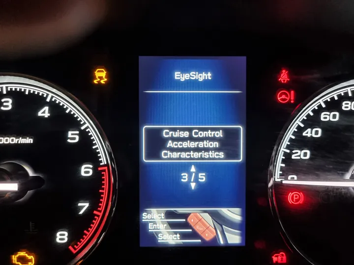

ความรู้สึกในการขับมาจากจุดเริ่มต้นถึงแวะกินข้าวตรงเส้นบายพาสโคราช คือรู้สึกสบายกว่าเดิมที่ใช้รถเล็กเดินทางมากๆ (เทียบกับ almera นะ) ทั้งเรื่องการซับแรงสะเทือนจากถนน และช่วงจังหวะเร่งขึ้นเขาหลบรถบรรทุกทั้งหลายระหว่างทางมาโคราช การเก็บเสียงสำหรับผมไม่ถือว่าดี แต่ไม่แย่ เพราะถ้าความเร็วเริ่มสูง เสียงก็ตามมาชัดเจนเลยทีเดียว แต่สำหรับขับแบบพ่อบ้านพาเที่ยว ถือว่าเก็บเสียงดีเลยครับ กำลังสบาย แต่ยังได้ยินเสียงจากสภาพแวดล้อมนอกรถอยู่ ช่วงนี้ผมน่าจะใช้งาน Cuise Control เกิน 50% ไม่ต้องเกร็งขาเพื่อคอนโทรลคันเร่งอีกต่อไป

เส้นมิตรภาพ ทางตรงยาวๆ Eyesight ยังทำงานได้ดีแต่สบายมากๆเหมือนเดิม ช่วงล่างเก็บความ(ไม่เรียบ)ของเส้นมิตรภาพได้ดี เพราะส่วนมากผมวิ่งซ้ายเนื่องจากขับไม่เร็ว ให้รถขับให้ยาวๆกันจนถึงก่อนขึ้นภูพานเลยทีเดียว

ภูพาน เป็นทางขึ้น - ลง ง่ายๆ ถนนค่อนข้างดี แต่จะเจอรถบรรทุกรายทางเยอะ ผมหยิบยกมาพูดถึงเพราะเป็นครั้งแรกที่ใช้รถเกียร์ auto ขับขึ้นเขา ลึกๆแอบมีความกังวล เพราะเดิมเราใช้เกียร์ธรรมดามาตลอด เราสามารถเลือกความหน่วงเวลาลงเขาไม่ให้เร็วเกินไปได้ตลอด auto แบบเดิมจะมี 2, L ให้ใช้ แต่เจ้าช้างศึกไม่มี มีแค่โหมด Manual มาเลย

แต่พอได้ขับจริง กลับง่ายกว่าที่คิด เพราะรถหน่วงให้กำลังพอดีเวลาเจอทางลาด หรือถ้าเรารู้สึกว่ายังไม่พอก็ลดเกียร์ที่ Paddle Shift ได้เลย โดยไม่ต้องเข้า manual mode แล้วมันก็จะกลับมาออโต้ให้เองตามความเหมาะสม ผมชอบนะ ไม่เสียสมาธิดี

หลังจากถึงสกลนคร ก็แวะกินข้าวและเติมน้ำมันแถวหน้าสนามบิน (เดิมเติมตอนออกเดินทางแถวๆปทุมธานี) รวมมาถึงได้ ได้อัตราสิ้นเปลืองที่ 15.34 Km/l สำหรับตัวนี้ ผมถือว่าโอเคมากๆครับ เพราะปกติขับ Almera เดินทางเส้นทางเดียวกัน ผมได้อัตราเสิ้นเปลืองประมาณ 17-18 Km/l แต่ความเหนื่อยล้าแตกต่างกันค่อนข้างมาเลยทีเดียว

ขอเพิ่มเติม หลายคนอาจจะมีความคาใจว่า Eyesight ใช้แต่กล้อง จะใช้งานกลางคืนได้หรือไม่ หรือใช้งานในขณะฝนตกหนักได้หรือไม่ ผมตอบแทนเลยว่ากลางคืนไม่มีปัญหาเลยครับ แม้ถนนต่างจังหวัดที่ไม่มีไฟทางและไฟข้างทาง ก็ยังตรวจจับรถคันอื่นได้ รวมถึงมอเตอร์ไซค์ที่ไฟท้ายไม่ค่อยสว่างก็เห็นปกติ (แต่ถ้าไม่มีไฟเลยไม่รู้นะ ยังไงเราต้องมีสติเสมอครับ)

สำหรับขณะฝนตกหนัก ก็ทำงานได้ดีมากกว่าที่คาดไว้ คือผมเจอฝนหนัก ระบบยังทำงานและตรวจจับรถคันอื่นๆได้ดีมากๆ จนตกหนักถึงขั้นกับที่ปัดน้ำฝนเบอร์แรงสุดเริ่มเอาไม่อยู่ ผมถึงเจอระบบตัด Eyesight และเข้าควบคุมรถเอง (เอาจริง ตอนนี้แทบจะต้องย่องไปแล้ว ฝนแรงมาก) กับวิ่งลุยน้ำขังด้วยความเร็วสูงๆ ตัวรถนิ่งมากแบบไม่ทีอาการเลย รู้สึกปลอดภัยกว่าตอนใช้รถเล็กเยอะมาก

ทั้งนี้ฟิลม์อาจจะมีผลด้วยเช่นกันนะครับ ของผมใช้ 3M Crystalline บานหน้า C40 รอบตัน C20 ระบบทำงานได้โดยไม่มีปัญหาอะไรเลยครับ

โดยรวมแล้วถือว่าตอบโจทย์ตามการเลือกใช้งานมากๆ คือได้รับความสะดวกสบายในการเดินทางที่เพิ่มขึ้น เป็นรถครอบครัวเป็นหลัก และยังสามารถขนของได้เยอะมากๆ เรื่องลุยๆยังไม่มีโอกาส ถ้าได้ทดสอบจะมาเล่าสู่กันฟังอีกทีครับ :blush:

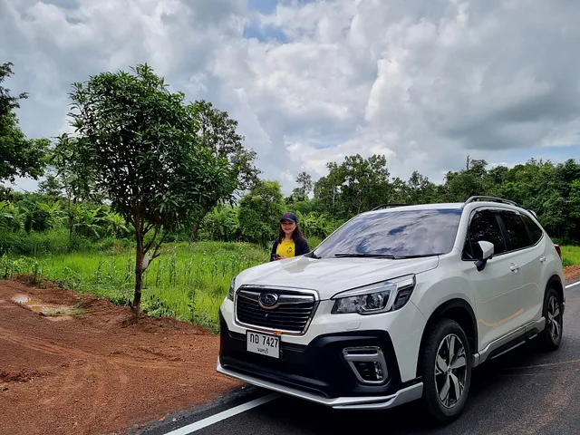
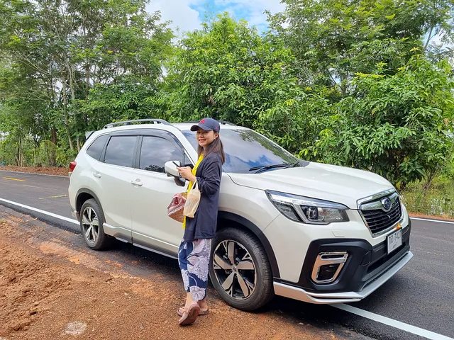
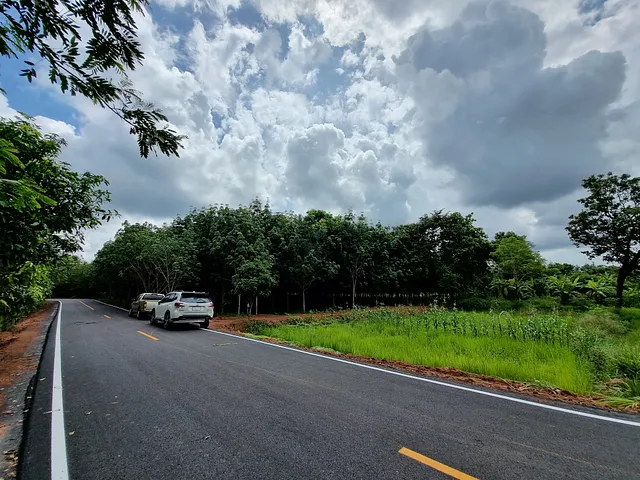
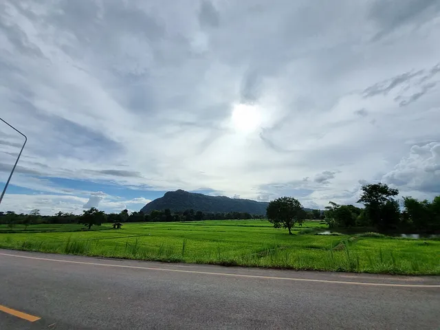

**Published** : 2022-07-17
