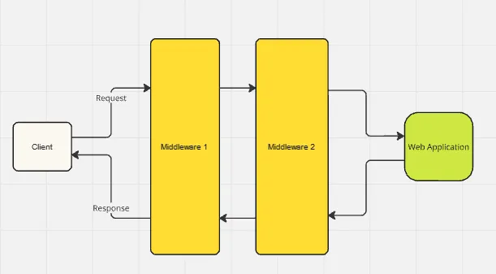

# ทำ Custom AspNet Middleware ใช้เอง

Middleware มองง่ายๆ มันคือ script/program ของเราตัวนึง ที่แทรกอยู่ตรงกลางเวลามีการเรียก Request มาที่แอพพลิเคชั่นเรา ถ้ามองเป็นรูปจะประมาณนี้



จะสังเกตุว่า ทุก request จะวิ่งผ่าน middleware เสมอ และก่อนกลับไปก็สามารถทำอะไรบางอย่างก่อนส่งกลับไปได้ เหมือน Middleware ครอบ web application อยู่ภายใน (ด่านชั้นนอก, ด่านชั้นใน) ทำนองนั้น

ซึ่งเราสามารถนำมาประยุกต์ทำงานได้หลากหลาย เช่น การ Modified request หรือ verify บางอย่างที่ต้องทำทุกรายการ, การเก็บ log request/response หรือแม้กระทั่งนำไปใช้ในการ handle exception เพื่อให้ระบบสามารถ handle ต่อได้ว่า error แล้วต้องตอบสนองต่อผู้ใช้งานยังไง

รวมถึงตัว middleware ไม่ได้จำกัดว่าจะมีกี่ตัว เราสามารถใส่ใช้งานได้ตามที่เราต้องการ แต่ยังไงก็อย่าลืมว่าทุกการทำงานมันสามารถส่งผลกับ performance ระบบเราเช่นกัน และเจ้าตัวนี้ทำตลอดด้วยสิ

เกริ่นพอละ มาลองทำ Middleware เล่นกันดีกว่า

```csharp
using Microsoft.AspNetCore.Http;
using System.Diagnostics;
using System.Threading.Tasks;

public class CustomMiddleware
{
    private readonly RequestDelegate _next;

    public CustomMiddleware(RequestDelegate next)
    {
        _next = next;
    }

    public async Task InvokeAsync(HttpContext context)
    {
        // ส่วนที่อยากให้ทำงานก่อน code ใน Controller
        var stopwatch = new Stopwatch();
        stopwatch.Start();

        // ส่ง context ไปทำงานตามปกติ
        await _next(context);  

        // หลังทำงานหลักเสร็จ จะกลับมาทำงานตรงนี้ต่อ
        stopwatch.Stop();
        var elapsedTime = stopwatch.ElapsedMilliseconds;

        Console.WriteLine($"Request took {elapsedTime} ms");
    }
}
```

โดยจากตัวอย่าง จะแบ่งการทำงานง่ายๆ คือเมื่อมี Request เข้ามา จะรัน code ในส่วนที่อยู่ก่อน `await _next(context);` หลังจากนั้นจึงส่งต่อไปทำงานที่ controller ตามที่เราเรียกเข้ามา และหลังจากจบการทำงานใน controller ก็จะมารันโค้ดส่วนที่เหลือต่อ ก่อนที่จะ response กลับไปให้ client

ตัวอย่างนี้จึงเป็นแค่การทำงานง่ายเช่นจับเวลาว่า request นี้ใช้เวลาทั้งสิ้นเท่าไหร่ โดยนำ `stopwatch` มาใช้เท่านั้นเลยครับ

เมื่อมี middleware เป็นของตัวเองแล้ว ถัดไปก็คือเราจะเรียกใช้ยังไง โดยสามารถทำได้ง่ายๆที่ `startup` ดังนี้

```csharp
using Microsoft.AspNetCore.Builder;

public class Startup
{
    public void Configure(IApplicationBuilder app)
    {
        // เรียกใช้ middleware
        app.UseMiddleware<CustomMiddleware>();

        // .. code อื่นๆ
    }
}
```

ซึ่งถ้ามีมากกว่า 1 ตัว เราเรียก `app.UseMiddleware<ชื่อ Middleware>();` ต่อไปได้เรื่อยๆเลยครับ

เป้นเพียงตัวอย่างง่ายๆ ลองนำไปประยุกต์ใช้กันดูครับ

**Published**: 2024-08-11
