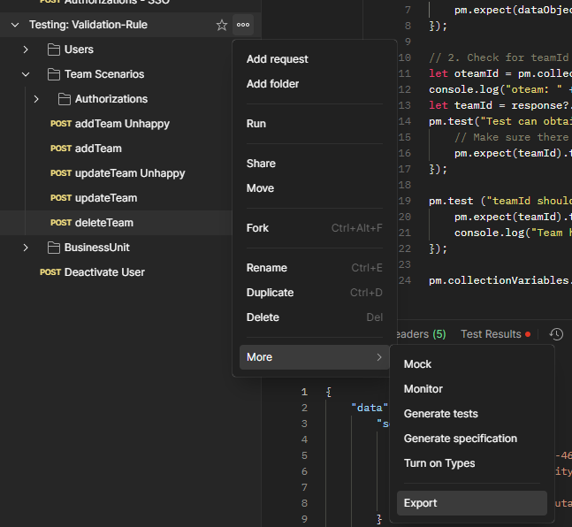
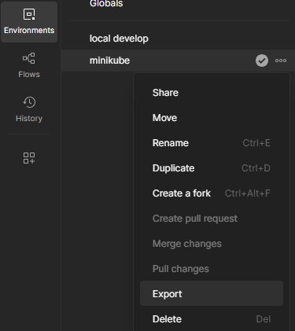
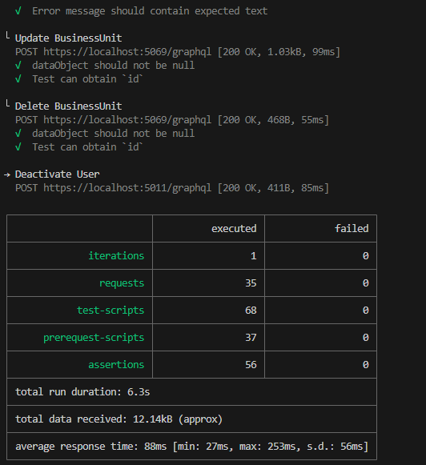

# :book: `newman` Testing cli for postman

To use postman as an automate testing and building the report for test result.

## Pre-Required

You need to run `npm` that required `NodeJs` for more information please go to [NodeJs](https://nodejs.org/en) website for installing it.

Export your `Collections` and `Environments` from Postman





Preparing your project folder, for example `D:\Works\Newman` and placing exported files to working folder

### Installing `newman`

To start working with `newman` we need to install by using npm, In this case will install globally becuase I use newman for vary tasks

```sh
npm install -g newman
```

## Running test

First running and check your result by using your collection and environment file by running

```sh
# Run command with: newman run [collections.json] -e [environment.json]
newman run ./yourcollection.postman_collection.json -e ./yourenvironment.postman_environment.json
```

if your environment using self-sign certificate you can added `--insecure` to allow case execute.

```sh
newman run ./yourcollection.postman_collection.json -e ./yourenvironment.postman_environment.json --insecure
```

They will running and summary result to show in terminal like this



## [Optional] Extra report html

[Optional] to install beautiful HTML report install additional package

```sh
npm install -g newman-reporter-htmlextra
```

added `args` to tell `newman` using new report engine

```sh
newman run ./yourcollection.postman_collection.json -e ./yourenvironment.postman_environment.json --insecure -r htmlextra
```

Report with generate to folder `./newman/newman_htmlextra_[running date time].html`
They are many extra report engine, please should your favourite one.
