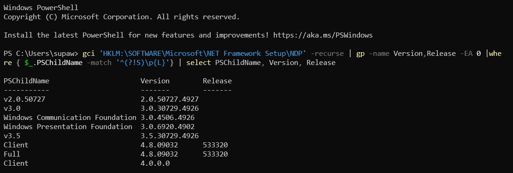

# .Net Framework Version Check

Use following command to check installed versions of .NET framework on windows system

``` powershell
gci 'HKLM:\SOFTWARE\Microsoft\NET Framework Setup\NDP' -recurse | gp -name Version,Release -EA 0 |where { $_.PSChildName -match '^(?!S)\p{L}'} | select PSChildName, Version, Release
```

You will get result as below


