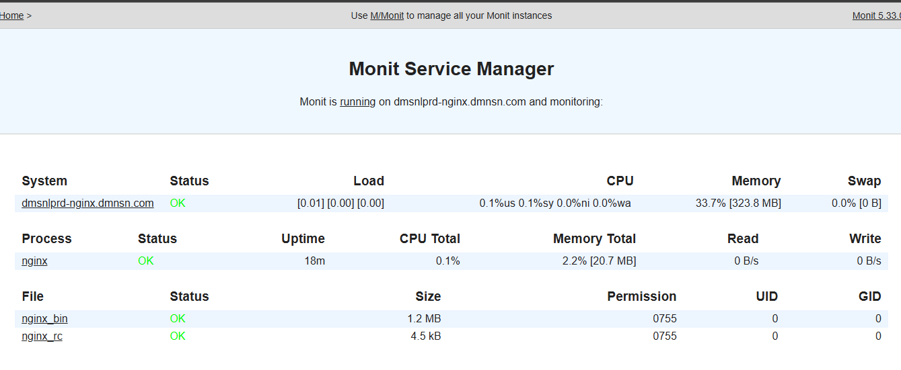

# :book: Monit

Monit is an open-source monitoring tool for Linux.

## Installation

Monit is available with Debain repositories.

Run the following commands:

```sh
sudo apt update
sudo apt install monit
```

Then `enable` to run as a service

```sh
sudo systemctl enable monit.service
```

## Basic Setup

Default configuration file is

```sh
sudo nano /etc/monit/monitrc
```

here is default configuration file that has update some option:

```conf
set daemon 20           # This will update healthcheck interval 20s
   with start delay 120 # Delay the first check by 2 minute after Monit start
...
set httpd port 2812 and
    use address 127.0.0.1  # Your IP Address
    allow admin:monit      # require user 'admin' with password 'monit'
```

This will enable web interface to monitor it.

access via http://127.0.0.1:2812

> :information_source: Please not change your IP follow the configuration file.



In my case, I need to monitor NGINX service and restart when it has stopped unexpectedly. We can use default configuration has bundled with `monit`

```sh
sudo ln -s /etc/monit/conf-available/nginx /etc/monit/conf-enabled/
```

After that reload monit configuration

```sh
sudo systemctl reload monit.service
```

Done, you can try to stop NGINX service and monitor it restart automatically to confirm everything is worked.

## Referrences

- [Using Monit process monitoring on Ubuntu/Debian](https://www.servers.com/support/knowledge/linux-administration/using-monit-process-monitoring-on-ubuntu-debian)
