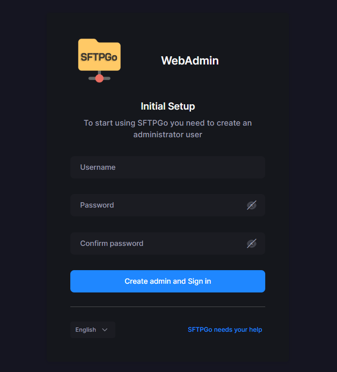

# :book: SFTPGo

SFTPGo is an event-driven file transfer solution. It support multiple protocols (SFTP, SCP, FTP/S, WebDAV, HTTP/S) and multiple storage backends.

## Installation

Install prerequired package

```sh
sudo apt install gnupg curl
```

Import the public key used by the package management system:

```sh
curl -sS https://ftp.osuosl.org/pub/sftpgo/apt/gpg.key | sudo gpg --dearmor -o /usr/share/keyrings/sftpgo-archive-keyring.gpg
```

Create SFTPGo source list:

```sh
CODENAME=`lsb_release -c -s`
echo "deb [signed-by=/usr/share/keyrings/sftpgo-archive-keyring.gpg] https://ftp.osuosl.org/pub/sftpgo/apt ${CODENAME} main" | sudo tee /etc/apt/sources.list.d/sftpgo.list
```

Install via `apt`

```sh
sudo apt update
sudo apt install sftpgo
```

## Data provider initialization and management

Before starting the SFTPGo server please make sure that the configured data provider is properly initialized/updated.

For PostgreSQL, MySQL and CockroachDB providers, you need to create the configured database. For SQLite, the configured database will be automatically created at startup. Memory and bolt data providers do not require any initialization but they could require an update to the existing data after upgrading SFTPGo.

SFTPGo will attempt to automatically detect if the data provider is initialized/updated and if not, will attempt to initialize/ update it on startup as needed.

default configuration file is:

```sh
sudo nano /etc/sftpgo/sftpgo.json
```

update `data_provider` configuration as you need

```sh
...
"data_provider": {
    "driver": "postgresql",
    "name": "dbname",
    "host": "db.ip.address",
    "port": 0,
    "username": "username",
    "password": "password",
    "sslmode": 0,
...
```

Alternately, you can create/update the required data provider structures yourself using the `initprovider` command.

```sh
sudo sftpgo initprovider
```

open browser and go to <http://you.ip.address:8080> to access web UI, at first time you will create admin account



## Referrences

- [SFTPGo document](https://docs.sftpgo.com/latest/)
