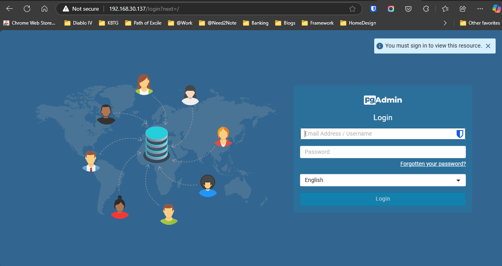

# 📖 pgAdmin 4: PostgreSQL Web Admin

`pgAdmin4` will help to manage `PostgreSQL` server easier, in this guide will install as web admin

## Setup repositories

Install the public key for the repository (if not done previously):

```sh
curl -fsS https://www.pgadmin.org/static/packages_pgadmin_org.pub | sudo gpg --dearmor -o /usr/share/keyrings/packages-pgadmin-org.gpg
```

Add repository source in this step will include run apt update too:

```sh
sudo sh -c 'echo "deb [signed-by=/usr/share/keyrings/packages-pgadmin-org.gpg] https://ftp.postgresql.org/pub/pgadmin/pgadmin4/apt/bookworm pgadmin4 main" > /etc/apt/sources.list.d/pgadmin4.list && apt update'
```

Install for Web mode

```sh
sudo apt install pgadmin4-web
```

if you want to install in desktop mode or both desktop and web you can uses:

```sh
# Desktop mode only
sudo apt install pgadmin4-desktop
# Both Desktop and Web
sudo apt install pgadmin4
```

After installation complete, run command to config webserver

```sh
sudo /usr/pgadmin4/bin/setup-web.sh
```

Now you can access `pgAdmin` by URL <http://127.0.0.1/pgadmin4>

## (Optional) Configuration pgAdmin URL base path

For individual reason, I need to run pgAdmin without suffix in URL

easiest way just configuration Apache webserver and restart service for it.

```sh
sudo nano /etc/apache2/conf-available/pgadmin4.conf 
```

Replace config

```sh
# From original
WSGIScriptAlias /pgadmin4 /usr/pgadmin4/web/pgAdmin4.wsgi
# Changed to
WSGIScriptAlias / /usr/pgadmin4/web/pgAdmin4.wsgi
```

And restart Apache web server

```sh
sudo systemctl restart apache2.service
```

Congratulations. You can access `pgAdmin` via <http://127.0.0.1>



## Referrences

- [pgAdmin - PostgreSQL Tools](https://www.pgadmin.org/)
